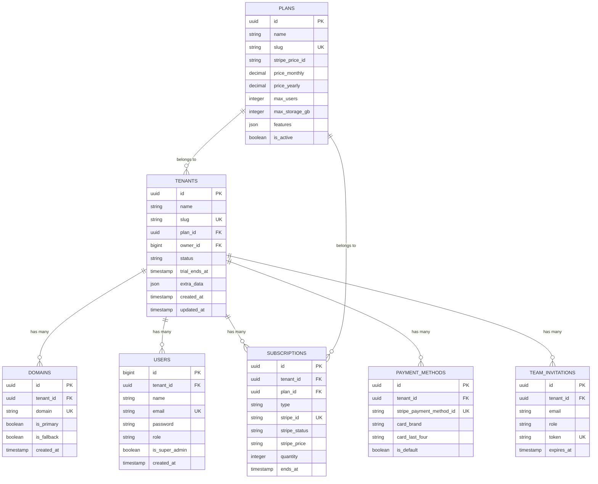

# Entity Relationship (ER) Diagram

The following Mermaid ER diagram illustrates the relational data architecture of the Multi-tenant SaaS application.

```mermaid
erDiagram
    TENANTS ||--o{ DOMAINS : "has many"
    TENANTS ||--o{ USERS : "has many"
    TENANTS ||--o{ SUBSCRIPTIONS : "has many"
    TENANTS ||--o{ PAYMENT_METHODS : "has many"
    TENANTS ||--o{ TEAM_INVITATIONS : "has many"
    PLANS ||--o{ TENANTS : "belongs to"
    PLANS ||--o{ SUBSCRIPTIONS : "belongs to"

    TENANTS {
        uuid id PK
        string name
        string slug UK
        uuid plan_id FK
        bigint owner_id FK
        string status
        timestamp trial_ends_at
        json extra_data
        timestamp created_at
        timestamp updated_at
    }

    DOMAINS {
        uuid id PK
        uuid tenant_id FK
        string domain UK
        boolean is_primary
        boolean is_fallback
        timestamp created_at
    }

    USERS {
        bigint id PK
        uuid tenant_id FK
        string name
        string email UK
        string password
        string role
        boolean is_super_admin
        timestamp created_at
    }

    PLANS {
        uuid id PK
        string name
        string slug UK
        string stripe_price_id
        decimal price_monthly
        decimal price_yearly
        integer max_users
        integer max_storage_gb
        json features
        boolean is_active
    }

    SUBSCRIPTIONS {
        uuid id PK
        uuid tenant_id FK
        uuid plan_id FK
        string type
        string stripe_id UK
        string stripe_status
        string stripe_price
        integer quantity
        timestamp ends_at
    }

    PAYMENT_METHODS {
        uuid id PK
        uuid tenant_id FK
        string stripe_payment_method_id UK
        string card_brand
        string card_last_four
        boolean is_default
    }

    TEAM_INVITATIONS {
        uuid id PK
        uuid tenant_id FK
        string email
        string role
        string token UK
        timestamp expires_at
    }
```
